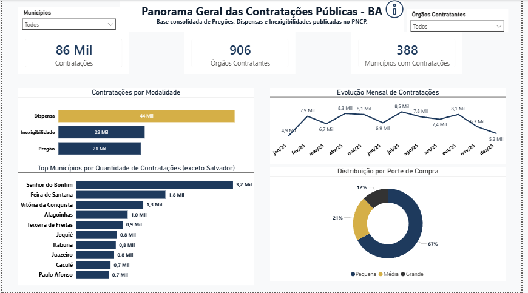

# 🏛️ Observatório PNCP 2025: Análise de Contratações Públicas da BAHIA
📖 Sobre o Projeto

Este projeto surgiu a partir da minha experiência atuando no setor de compras da FUNDAC. Durante esse período, frequentemente me questionava sobre como outros órgãos públicos conduziam seus processos de contratação e quais práticas poderiam servir de referência para aprimorar a gestão das compras públicas e como melhorar internamente.

Com esse interesse, estou desenvolvendo o Observatório PNCP 2025, um projeto de análise de dados voltado para a exploração e consolidação de informações de licitações e contratos públicos disponibilizados pelo Portal Nacional de Contratações Públicas (PNCP).

Para este estudo, foi definido um recorte específico no Estado da Bahia, concentrando a análise exclusivamente nas contratações realizadas por órgãos e entidades públicas baianas ao longo de 2025. Essa abordagem permite uma visão mais detalhada da realidade local, possibilitando identificar padrões, tendências e características das contratações públicas no estado.

Além de promover uma visão mais ampla sobre as compras governamentais, este projeto também teve como objetivo aprofundar meus conhecimentos em Análise de Dados, ETL, consumo de APIs e visualização de informações.

🎯 Objetivo

Realizar uma análise consolidada das contratações públicas realizadas em 2025, identificando padrões, tendências e indicadores relevantes que possam contribuir para a compreensão da eficiência, transparência e competitividade dos processos de compras governamentais.

🔍 Escopo da Análise

>[!IMPORTANT]
Todos os dados analisados neste projeto referem-se exclusivamente a contratações públicas registradas por órgãos e entidades localizados no Estado da Bahia. Portanto, os resultados apresentados não representam o cenário nacional, mas sim um recorte específico das contratações públicas baianas durante o ano de 2025.

A coleta, tratamento e análise dos dados foram concentrados nas modalidades de contratação com maior relevância e volume de utilização na Administração Pública:
*   **Pregão Eletrônico:** Análise da competitividade e economia gerada em processos eletrônicos.
*   **Dispensa de Licitação:** Monitoramento das contratações diretas por valor ou emergência.
*   **Inexigibilidade:** Acompanhamento de contratações de fornecedores exclusivos ou serviços técnicos especializados.

## 🛠️ Tecnologias Utilizadas

*   🐍 **Python** (Pandas, Requests, SQLAlchemy)
*   🗄️ **SQL / PostgreSQL**
*   📊 **Power BI**
*   🐙 **Git & GitHub**

## 🔄 Arquitetura do Projeto
*   🌐 **PNCP API** (Fonte de Dados)
*   ➡️ **Python** (Extração via Requests)
*   ➡️ **Pandas** (Transformação e Limpeza)
*   ➡️ **PostgreSQL** (Carga e Persistência)
*   ➡️ **Power BI** (Visualização de Dados)
*   ➡️ **Análise e Storytelling** (Insights de Negócio)

📊 Dashboard - Panorama Geral

Nesta primeira etapa foi desenvolvido um dashboard executivo para compreender o perfil geral das contratações públicas realizadas pelos órgãos e entidades do Estado da Bahia.

Principais Achados

1. **Predomínio de dispensas:** Mais da metade das contratações registradas ocorreu por meio de Dispensa de Licitação.
2. **Contratações de pequeno porte:** Aproximadamente 67% das contratações estão classificadas como de pequeno porte (até R$ 80 mil).
3. **Relação direta:** Cerca de 96% das Dispensas estão associadas a compras de pequeno porte.
4. **Destaque regional:** Excluindo Salvador, Senhor do Bonfim apresentou o maior volume de contratações registradas no período analisado.
5. **Sazonalidade:** Observou-se redução no volume de publicações de contratações entre dezembro e janeiro, seguida de retomada nos meses subsequentes.

📄 Visualizar Dashboard em PDF:
[Observatorio_PNCP_Bahia_2025.pdf](Docs/Observatorio_PNCP_Bahia_2025.pdf)

⚠️ Observação sobre os Dados

Os resultados apresentados refletem exclusivamente os dados disponibilizados pelo Portal Nacional de Contratações Públicas (PNCP).

Durante a análise exploratória foram identificados registros com valores extremamente elevados quando comparados à distribuição geral da base. Esses casos serão investigados em uma etapa específica dedicada à qualidade e consistência dos dados disponibilizados pelo PNCP.

Portanto, os indicadores apresentados neste painel devem ser interpretados considerando as limitações inerentes à base pública analisada.

🚧 Próximas Etapas

* **Análise Financeira das Contratações Públicas**
* **Qualidade e Transparência dos Dados do PNCP**
* **Investigação de Valores Potencialmente Inconsistentes**
* **Análise de Economia Gerada nas Contratações**
* **Consolidação do Dashboard Analítico Final**

